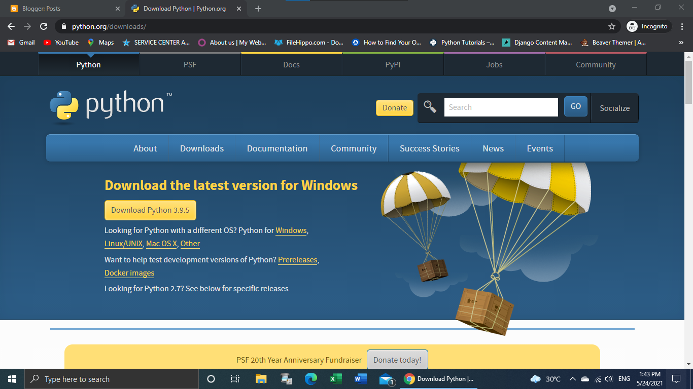
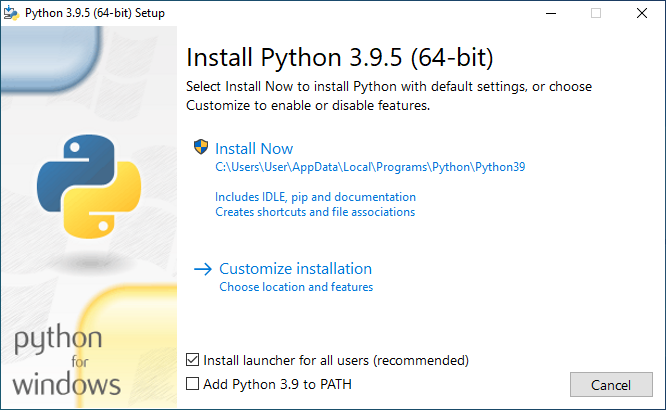
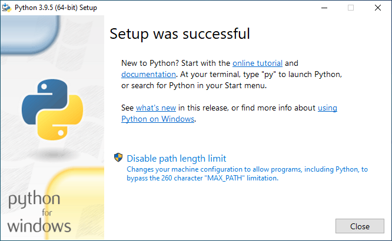

# INSTALASI PYTHON 

Bagi pengguna Linux, Python tidak perlu diinstal. Karena Sebagian besar distro Linux sudah
menyediakannya secara default.
Bagi pengguna Windows, Download di situs resmi python (python.org). Ikuti langkah instalasinya.

Kunjungi halaman python berikut lalu klik download.

Klik "Install Now", adapun untuk opsi "Add Python 3.9 to PATH" bisa Anda centang atau tidak. Pada contoh saya kali ini saya centang tapi pas screenshot belum tercentang.

Ikuti langkah instalasi dan tunggu proses sampai selesai,jika sudah selesai silahkan klik Close.

# LATIHAN 1

