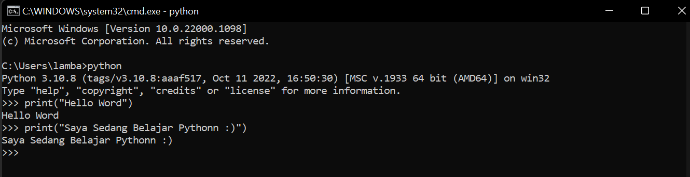
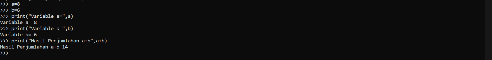
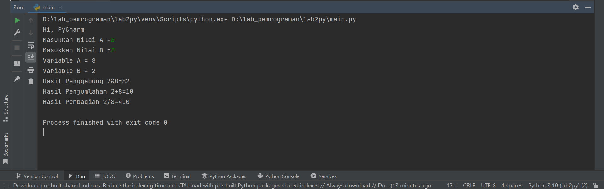

# INSTALASI PYTHON 

Bagi pengguna Linux, Python tidak perlu diinstal. Karena Sebagian besar distro Linux sudah
menyediakannya secara default.
Bagi pengguna Windows, Download di situs resmi python (python.org). Ikuti langkah instalasinya.

Kunjungi halaman python berikut lalu klik download.

Klik "Install Now", adapun untuk opsi "Add Python 3.9 to PATH" bisa Anda centang atau tidak. Pada contoh saya kali ini saya centang tapi pas screenshot belum tercentang.

Ikuti langkah instalasi dan tunggu proses sampai selesai,jika sudah selesai silahkan klik Close.

## LATIHAN 1

Buka CMD pada komputer  
Menjalankan Python Console dengan cara mengetikkan "python" 
Menampilkan tulisan “Hello” dilayar 
Menampilkan tulisan “Saya sedang belajar python” dilayar 

## LATIHAN 2

Menjumlahkan dua buah bilangan menggunakan variabel a dan b. 

a = 8  
b = 6 
print ("variable a=",a) 
print ("variable b=",b) 
print ("hasil penjumlahan a+b=",a+b) 
 
• Mendefinisikan variable a dengan nilai 8 
• Mendefinisikan variable b dengan nilai 6 
• Mencetak nilai variable a dan b 
• Mencetak hasil penjumlahan a+b 

## LATIHAN 3

• Menjalankan IDLE 
• Membuat file baru dengan nama latihan3.py (pastikan lokasi file
pada folder lab2py pada direktori kerja anda) 
• Menggunakan fungsi input untuk mengambil nilai variabel dari
keyboard. 
Masukkan perintah berikut:

#Input nilai variable 
a=input("Masukkan Nilai A =") 
b=input("Masukkan Nilai B =") 

#Cetak nilai variable 
print("Variable A =", a) 
print("Variable B =", b) 

#Cetak hasil operasi kedua variable dengan string format 
print("Hasil Penggabung {1}&{0}=%s".format(a,b) %(a+b)) 

#Konversi nilai variable 
a=int(a) 
b=int(b) 
print("Hasil Penjumlahan {1}+{0}=%s".format(a,b) %(a+b)) 
print("Hasil Pembagian {1}/{0}=%s".format(a,b) %(a/b)) 

Jika sudah run dan lihat apakah sudah sesuai tidak ada kesalahan atau eror

SELESAI :)
TERIMA KASIH.

